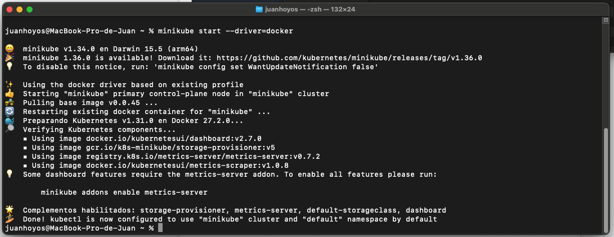
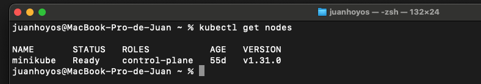
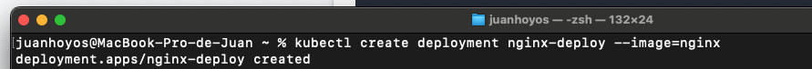
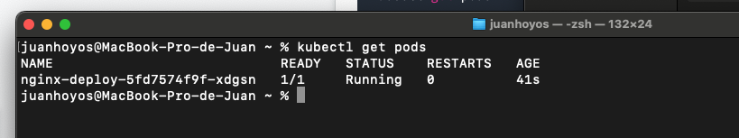
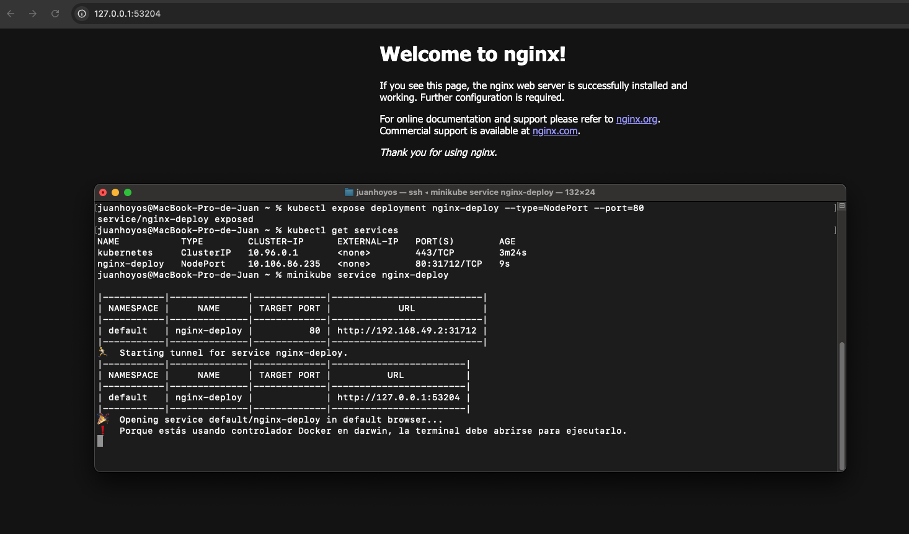
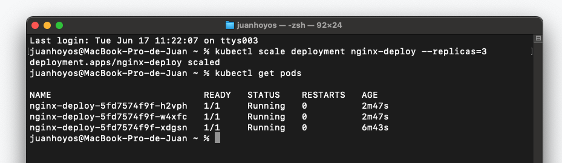
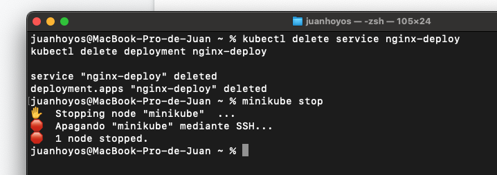

# Kubernetes Nivel Básico - Laboratorio Local con Minikube

Este repositorio documenta un laboratorio práctico de Kubernetes realizado en un entorno local utilizando Minikube.

## 📋 Tabla de Contenidos
1. [Requisitos](#requisitos)
2. [Configuración Inicial](#configuración-inicial)
3. [Despliegue](#desplegar-aplicación)
4. [Servicios](#exponer-servicio)
5. [Escalado](#escalar-aplicación)
6. [Limpieza](#limpieza)

## 🛠 Requisitos
- Minikube instalado
- kubectl

## ⚙️ Configuración Inicial

### Versión de Minikube

## Desplegar Aplicación

### Crear el deployment

### Verificar el pod

## Exponer Servicio

### Crear el servicio y acceder a la aplicación

## Escalar Aplicación

### Escalar el deployment

## Limpieza

### Eliminar el deployment y el servicio

